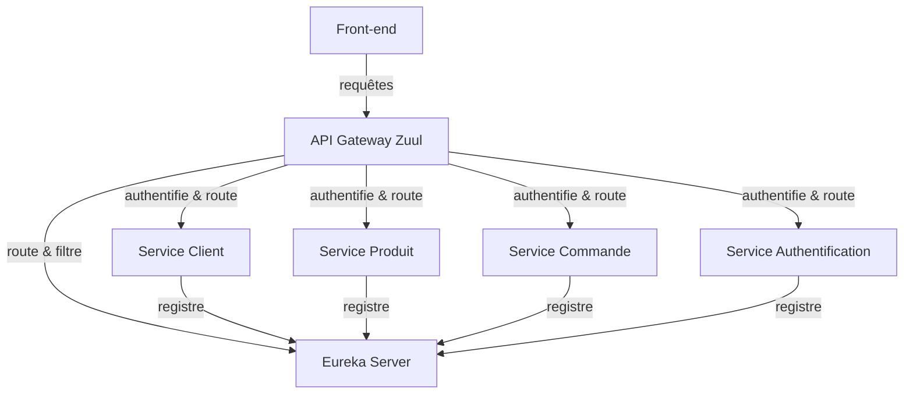

# Projet de Micro-Services pour E-Commerce

## Description

Ce projet est une démonstration d'une architecture de micro-services pour une application de e-commerce. Il utilise Spring Boot pour le développement des services, Eureka pour la gestion de la découverte des services, et Zuul comme API Gateway pour router et filtrer les requêtes. Ce système est conçu pour être simple mais évolutif, permettant une séparation claire des responsabilités via différents micro-services.

## Architecture

### Composants du Système

- **API Gateway (Zuul)**: Sert de point d'entrée unique pour toutes les requêtes externes. Il est responsable de router les requêtes vers les services appropriés et applique des politiques de sécurité pour l'authentification et la validation des requêtes.
- **Service de Découverte (Eureka)**: Permet à chaque micro-service de s'enregistrer et facilite la découverte dynamique des instances de service pour la communication inter-services.
- **Service d'Authentification**: Gère l'authentification des utilisateurs et la génération de tokens de sécurité.
- **Service Client**: Responsable de la gestion des informations clients, telles que les enregistrements et les mises à jour des profils.
- **Service Produit**: Gère les opérations relatives aux produits de l'e-commerce, telles que l'ajout, la suppression et la mise à jour des produits.
- **Service Commande**: Traite les commandes des clients, incluant la création, le suivi et la gestion des états des commandes.

### Diagramme d'Architecture

### Technologies Utilisées

- **Spring Boot**: Framework de développement pour les micro-services.
- **Spring Security & JWT**: Pour la sécurisation et l'authentification.
- **Netflix Zuul & Eureka**: Pour la gestion des routes et la découverte des services.
- **PostgreSQL**: Base de données pour la gestion des données des services.
- **Docker**: Utilisé pour la conteneurisation des services pour faciliter le déploiement.

## Installation

*Instructions d'installation seront ajoutées ici une fois le projet prêt pour le déploiement.*

## Utilisation

*Des exemples d'utilisation et des instructions détaillées seront fournis ici pour aider les utilisateurs à démarrer avec l'application une fois celle-ci déployée.*

## Licence

*Informations sur la licence sous laquelle le projet est distribué seront ajoutées ici.*

